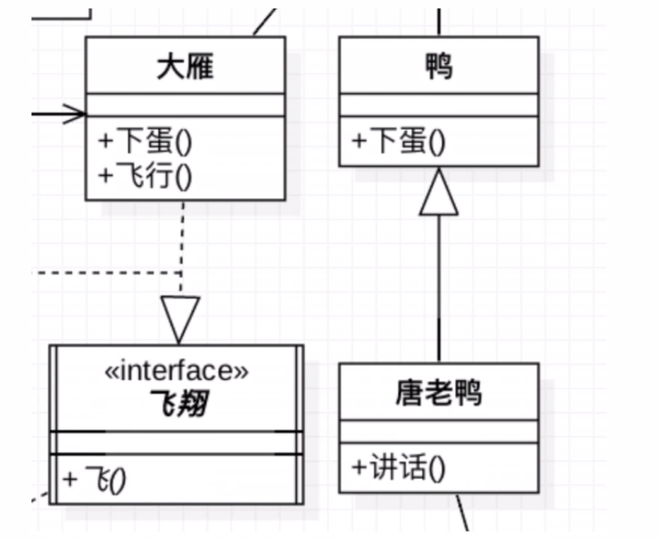
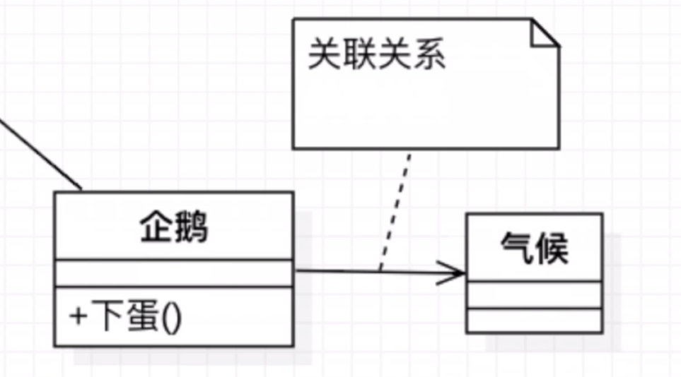
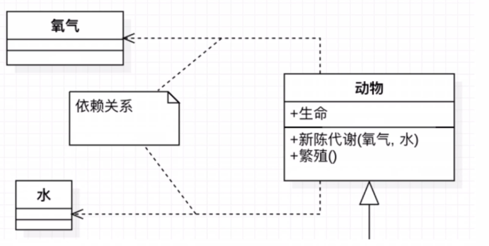
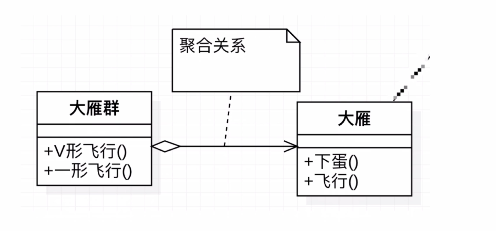
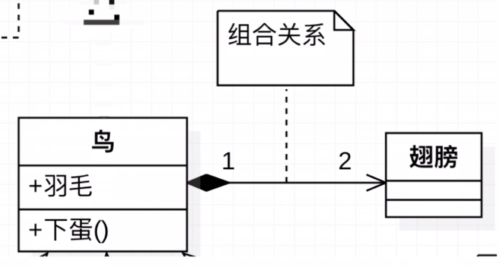
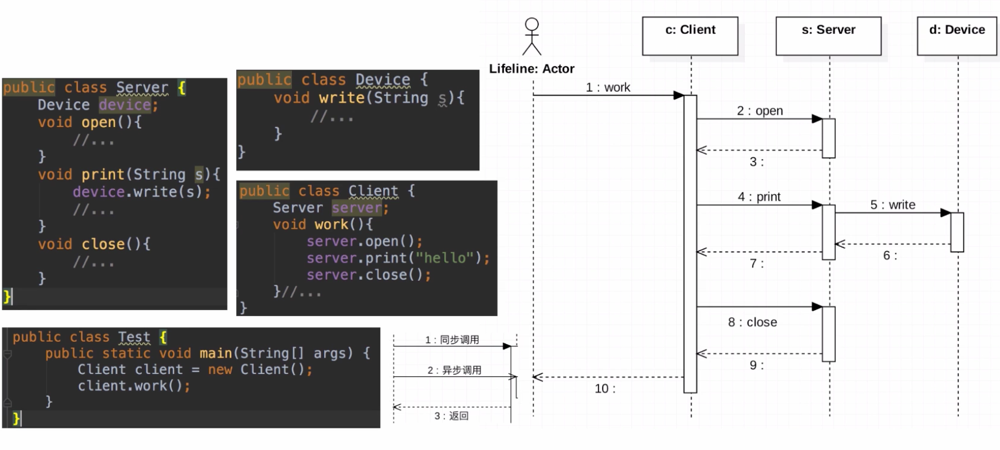
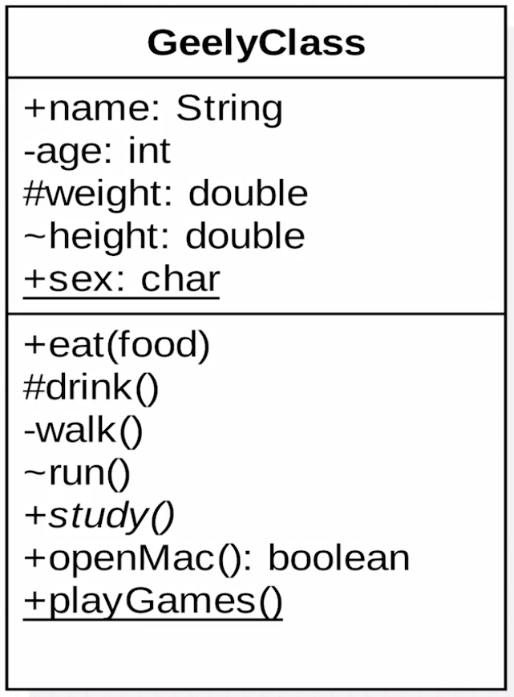
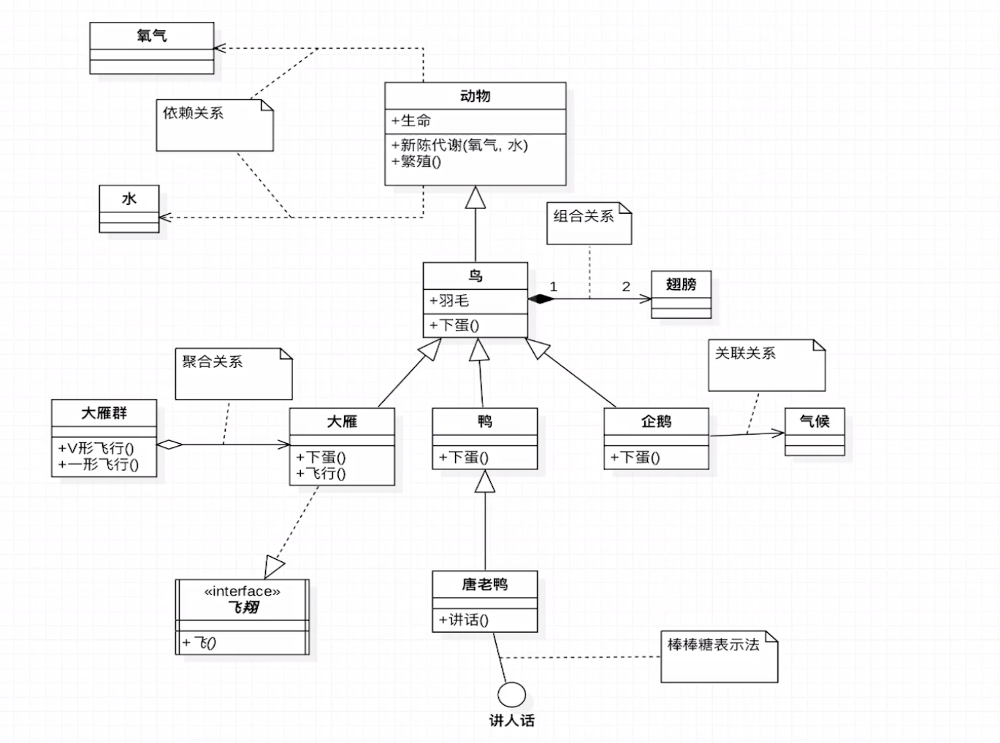
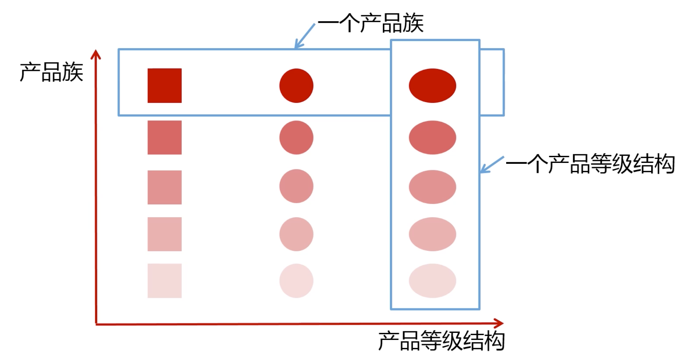
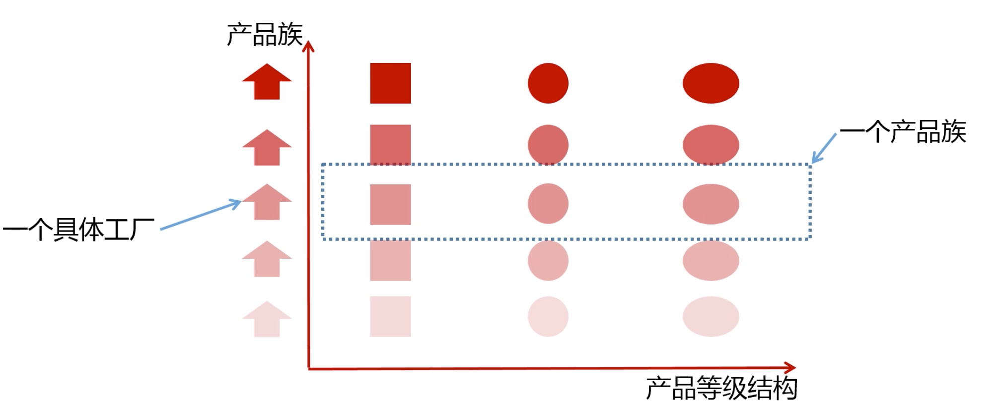

# 设计模式

## UML 简单入门

### UML 类图和时序图介绍

- 类图的定义

  - 统一建模语言 unified modeling language
  - 非专利的第三代建模和规约语言

- 类图的特点

  - 开放的方法
  - 用于说明、可视化、构建和编写一个正在开发的面向对象的、软件密集系统的制品的开放方法
  - 一系列最佳工程实践
    - 这些最佳实践在大规模、复杂系统进行建模方面，特别是在软件架构层次已被认证有效

- 类图的分类

  - UML2.2分类
    - 结构式图形：强调的是系统式的建模
      - 静态图：类图、对象图、包图
      - 实现图：组件图、部署图
      - 剖面图
      - 复合结构图
    - 行为式图形：强调系统模型中触发的事件
      - 活动图
      - 状态图
      - 用例图
    - 交互式图形：属于行为式图形的子集合，强调系统模型中资料流程
      - 通信图
      - 交互概述图（UML2.0）
      - 时序图（UML2.0）
      - 时间图（UML2.0）

- 类图

  - Class Diagram：用于表示类、接口、实例等之间相互的静态关系

  - 记忆技巧：

    - 实现和继承

      

      - UML的箭头方向：从子类指向父类
      - 空心三角箭头表示继承或实现
        - 虚线表示实现
        - 实现表示继承 

    - 箭头表示关联｜依赖

      - 实线关联

         

        - 类中另外一个类为属性

      - 虚线依赖

         

        - 类为方法的返回或方法的参数

    - 空心菱形 聚合

      

      - 代表空器皿里可以放很多东西，聚在一起（箭头所指的类）
      - 整体和局部的关系，有独立的生命周期，是 has a关系，是个弱关系 就是空心

    - 实心菱形 组合

      

      - 代表满器皿中已经有实体结构的存在，生死与共
      - 整体和局部的关系，有相同的生命周期，contains-a关系，强关系 实心

      

      > 常见的数字表示含义
      >
      > 假设有A类和B类，数字标记在A侧
      >
      > 0..1  B类和0或1个A实例相关
      >
      > 0..*   B类和0或多个A实例相关
      >
      > 1..1. B类和1个A实例相关
      >
      > 1      B类和A类只有一个相关
      >
      > 1..*   B类和A类至少有一个实例相关

      

- 时序图

  ​	

  - Sequence Diagram：是显示对象之间交互的图，这些对象是按照时间排列的
  - 包含元素：
    - 对象 Actor
    - 生命线 Lifeline
    - 控制焦点 Focus of control
    - 消息 message 

  

### UML类图详细说明



> 第一行：类的说明：抽象类，实体类，接口
>
> 第二行：类的属性 
>
> ​	+ public - private #protected  ～default  横线代表static 
>
> 第三行：类的行为


- 实例

  


## 设计原则

### 开闭原则

- 定义
  - 一个软件实体如类、模块、函数应该对扩展开放，对修改关闭
- 精髓
  - 用抽象构建架构，用实现扩展细节
  - 面向抽象编程
- 优点
  - 提高软件系统的可复用性及可维护性

### 依赖倒置原则

- 定义

  - 高层模块不应该依赖低层模块，二者都应该依赖其抽象

    > 高层模块是指：最底层的模块 

  - 抽象不应该依赖细节，细节应该依赖抽象

  - 针对接口编程，不要针对实现编程

- 精髓

  - 依赖接口编程

- 优点

  - 减少类之间的耦合性、提高系统的稳定性、提高代码可读性和可维护性，可降低修改程序所造成的风险

### 单一职责原则

- 定义
  - 不要存在多于一个导致类变更的原因
  - 一个类/一个接口/一个方法负责一项职责
- 精髓
  - 接口和方法一定遵循，但是类可以考虑
- 优点
  - 降低类的复杂度、提高类的可读性、提高系统的可维护性、降低变更引起的风险

### 接口隔离原则

-  定义
  - 用多个专门的接口，而不使用单一的总接口，客户端不应该依赖它不需要的接口
  - 一个类和一个类的依赖应该建立在最小的接口上
  - 建立单一接口，不要建立庞大臃肿的接口
  - 接口尽量细化，接口中的方法尽量少
  - 必须要遵循适度原则
- 优点
  - 符合高内聚和低耦合的设计思想，使得类有很好的可读性、可扩展性和可维护性

### 迪米特法则（最少知道原则）

- 定义

  - 一个对象应该对其他对象保持最少的了解，又叫最少知道原则
  - 尽量降低类与类之间的耦合

- 精髓

  - 只和朋友交流，不和陌生人说话

    > 朋友
    >
    > ​	出现在成员变量，方法的输入，输出参数重的类成为成员朋友，而出现在方法体内部的类不属于朋友

- 优点

  - 降低类之间的耦合

### 里氏替换原则

- 定义
  - 如果对每一个类型为T1的对象o1，都有类型为T2的对象O2，使得以T1定义的所有程序P在所有对象O1都替换成O2时，程序P的行为没有发生变化，那么类型T2就是类型T1的子类型
  - 子类对象可以替换父类对象，程序的逻辑不变
  - 子类可以扩展父类的功能，但是不能改变父类原有的功能
    - 子类可以实现父类的抽象方法，但是不能覆盖父类的非抽象方法
    - 可以扩展自己的特有方法
    - 子类的方法重载父类的方法时，方法的前置条件（入参）要比父类方法的输入参数更加宽松
    - 子类的方法实现父类的方法（重写/重载或实现抽象方法），方法的后置条件（返回值）要比父类更严格或相等
- 优点
  - 约束继承泛滥，开闭原则的一种体现
  - 加强程序的健壮性，同时变更时也可以做到非常好的兼容性，提高程序的可维护性、扩展性。降低需求变更的引入的风险

### 合成/复用原则（组合/复用原则）

- 定义
  - 尽量使用组合、聚合，而不是继承来达到软件的复用的目的
- 优点
  - 是系统更加灵活，降低类之间的耦合度，一个类的变化对其他类造成影响相对较少


## 设计模式

### 设计模式分类

- 创建型模式
  - 工厂方法模式
  - 抽象工厂方法模式
  - 建造者模式
  - 单例模式
  - 原型模式
- 结构型模式
  - 适配器模式
  - 装饰者模式
  - 代理模式
  - 外观模式
  - 桥接模式
  - 组合模式
  - 享元模式
- 行为型模式
  - 策略模式
  - 观察者模式
  - 责任链模式
  - 备忘录模式
  - 模版方法模式
  - 迭代器模式
  - 中介者模式
  - 命令模式
  - 访问者模式
  - 解释器模式
  - 状态模式


### 设计模式详细

#### 简单工厂模式

- 定义
  - 有一个工厂对象决定创建出哪一种产品的实例
  - 类型：创建型，但是不属于GOF23中设计模式
- 使用场景
  - 工厂类创建的对象比较少
  - 客户端（应用层）只知道传入工厂类的参数，对于如何创建对象的逻辑不关心
- 优点
  - 只需要传入一个正确的参数，就可以获取你所属需要的对象，而无需知道其创建细节
- 缺点
  - 工厂类的职责相对过大，增加新的产品需要修改工厂类的判断逻辑，违背了开闭原则
- JDK 源码中的简单工厂模式
  - Calendar 类的getInstance方法
  - Class.forName("") 加载数据库驱动
  - Logback 的getLoggger方法

#### 工厂方法

- 定义

  - 定义一个创建对象的接口，但是让实现这个接口的类来决定实例化哪个类，工厂方法让类的实例化推迟到子类中进行
  - 类型：创建型

- 使用场景

  - 创建对象需要大量的重复代码
  - 客户端（应用层）不依赖于产品类实例如何被创建、实现等细节
  - 一个类通过其子类来指定创建哪个对象

- 优点

  - 用户只需要关心所需产品的工厂，无须关心创建细节
  - 加入新的产品符合开闭原则，提高可扩展性

- 缺点

  - 类的个数容易过多，增加复杂度
  - 增加了系统的抽象性和理解难道

  > 产品等级和产品族
  >
  > 产品等级：海尔的冰箱，美的的冰箱属于同一产品等级
  >
  > 产品族：美的的风扇，美的的洗衣机，美的的冰箱 属于同一产品族，如果需要解决产品族的问题需要引入抽象工厂

- JDK的中的体现

  - Colletions的iterator()方法采用了工厂方法
  - URLStreamHandlerFactory中的createURLStreamHandler方法就是工厂方法
  - logback的getlogger方法


#### 抽象工厂

- 定义

  - 抽象工厂模式提供了一个创建一系列相关或相互依赖的对象的接口
  - 类型：创建型
  - 无须指定它们具体的类

- 适用场景

  - 客户端不依赖于产品类实现如何被创建、实现细节等
  - 强调一系例相关的产品对象（属于同一个产品族）一起使用创建对象需要大量重复的代码
  - 提供一个产品类的库，所有的产品都以同样的接口出现，从而使客户端不依赖于具体的实现

- 优点

  - 具体产品在应用层代码隔离，无须关心创建细节
  - 将一个系列的产品族放在一起创建

- 缺点

  - 规定了所有可能被创建的产品的集合，产品族中扩展新的产品比较困难，需要修改抽象工厂的接口
  - 增加了系统的抽象性和理解难度

- 产品等级结构和产品族，相对固定的产品结构组成了产品集

  


​	


- JDK 中的使用
  - Java.sql.Connection的createConnection
  - Mybatis 中的SqlSessionFactory


#### 建造者模式

- 定义
  - 将一个复杂对象的构建与它的表示分离，使得同样的构建过程可以创建不同的表示
  - 用户只需要指定需要建造的类型就可以得到它们，建造过程和细节不需要知道
  - 类型：创建型
- 适用场景
  - 如果一个对象有非常复杂的内部结构
  - 复杂的对象创建和使用分离
- 优点
  - 封装性好，创建和使用分离
  - 扩展性好，创建类之间独立，一定程度上解耦
- 缺点
  - 会产生多余的Builder对象
  - 产品内部发生变化，建造者都要修改，成本较大
- JDK中的源码
  - StringBuilder和StringBuffer
  - guva框架中ImmutableSet的建造者模式


#### 单例模式

- 定义

  - 保证一个类只有一个实例，并提供一个全局访问点
  - 类型：创建型

- 适用场景

  - 想确保任何情况下都绝对只有一个实例

- 优点

  - 只有一个实例，减少了内存开销
  - 可以避免资源的多重占用
  - 设置全局访问点，严格控制访问点

- 缺点

  - 没有接口，扩展比较麻烦

- 精髓

  - 私有构造器
  - 需要保证线程安全
  - 保证延迟加载
  - 序列化和反序列化安全
  - 防止反射攻击

  > 实用技能
  >
  > ​    反编译：对枚举的反编译
  >
  > ​    jvm内存：
  >
  > ​    多线程Debug：

- 常见的和单例的组合

  - 单例模式和工厂模式
  - 单例模式和享元模式
  
- 单例模式

  - 需要考虑线程安全、反编译、和序列化和反序列化造成的单例破坏
  - 最优雅的单例模式是枚举方式实现的

- 源码实例

  - Jdk

    - Runtime
    - Desktop

  - spring中的单例

    - AbstractFactoryBean#getObject

  - Mybatis中的单例

    - ErrorContext
      - 是线程的单例

    

#### 原型模式

- 定义

  - 原型实例指定创建对象的种类，并且通过拷贝这些原型创建新的对象
  - 不需要知道任何创建细节，不调用构造函数
  - 类型：创建型

- 适用场景

  - 类初始化消耗较多资源
  - new 产生的一个对象需要非常繁琐的过程（数据准备，访问权限等）
  - 构造函数比较复杂
  - 循环体中产生大量对象时

- 优点

  - 性能比直接new一个对象性能高
  - 简化创建过程

- 缺点

  - 必须配备克隆方法
  - 对克隆复杂对象或对克隆出的对象进行复制改造是，容易引入风险【深拷贝、浅拷贝】
  - 深拷贝、浅拷贝要运用得当

- 扩展

  - 深克隆，建议采用这种模式实现原型模式

    > 引用指向不同的对象，需要指定某个属性是否需要深拷贝，被拷贝对象中引用类型属性也需要实现Cloneable 接口实现clone方法

  - 浅克隆

    > 默认是浅克隆

  - 破坏单例克隆

    ```java
    package hcute.hoo.design.pattern.creational.prototype.clone;
    
    import java.io.Serializable;
    
    public class HungrySingleton implements Serializable,Cloneable {
    
        private static final HungrySingleton hungrySingleton = new HungrySingleton();
    
        public static  HungrySingleton getInstance(){
            return hungrySingleton;
        }
    
        @Override
        protected Object clone() throws CloneNotSupportedException {
    
    //        return super.clone();
            // 解决克隆带来的单例破坏问题
            return getInstance();
        }
    }
    
    ```

- 在源码中的应用

  - Object 的clone 是个native 方法，表明直接是内存级别的clone
  - Mybatis 中的CacheKey


#### 外观模式

- 定义：
  - 又叫做门面模式，提供一个统一的接口，用来访问子系统中的一群接口
  - 外观模式定义了了一个高层接口，让子系统更容易使用
  - 类型：结构型
- 适用场景
  - 子系统越来越复杂的时候，增加外观模式提供简单调用接口
  - 构建多层系统结构，利用外观对象作为每层的入口，简化层间调用
- 优点
  - 简化了调用过程，无须深入子系统，防止带来风险
  - 减少系统依赖，松散耦合
  - 更好的划分访问层次
  - 符合迪米特法则，即最少知道原则
- 缺点
  - 增加子系统、扩展子系统行为容易引入风险
  - 不符合开闭原则
- 相关设计模式
  - 外观模式和中介者模式
  - 外观模式和单例模式
  - 外观模式和抽象工厂模式
- 在源码中的应用
  - spring 中的JdbcUtils
  - mybatis 中的Configuration
  - Tomcat 中的RequestFacade


#### 装饰者模式

- 定义
  - 在不改变原有的对象的基础上，将功能附加到对象上
  - 提供了比继承更有弹性的替代方案（扩展原有对象的功能）
  - 类型：结构型
- 使用场景
  - 扩展一个类的功能或给一个类添加附加职责
  - 动态给一个对象添加功能，这些功能可以再动态的撤销
- 优点
  - 是继承的有力补充，比继承灵活，不改变原有对象的情况下给一个对象扩展功能
  - 不同的装饰类的组合，可以实现不同的效果
  - 符合开闭原则
- 缺点
  - 出现更多的代码，更多的类，增加程序的复杂性
  - 动态装饰时，多层装饰时会更复杂
- 相关设计模式
  - 装饰者和代理模式
    - 装饰者给对象动态添加方法：通常原始对象作为参数传入装饰者的构造器
    - 代理模式控制对对象的访问：常常在对象中创建代理对象的模式
  - 装饰者和适配器模式
    - 装饰者和被装饰者继承同一个对象
    - 适配器：适配器和被适配器实现不同接口
- 在源码中的应用
  - java.io.BufferedRead类是Reader类的装饰者
  - spring 中的TransactionAwareCacheDecorator类
  - servlet中的HttpServletRequestWrapper类
  - mybatis中的Cache


#### 适配器模式

- 定义：
  - 将一个类的接口转换成客户期望的另一个接口
  - 使原本接口不兼容的类可以一起工作
  - 类型：结构型
- 适用场景
  - 已存在的类，它的方法和需求不匹配时（方法结果相同或相似）
  - 不是软件设计阶段考虑的设计模式，是随着软件维护，由于不同的产品、不同的厂家造成功能类似而接口不同的情况下的解决方案
- 优点
  - 提高类透明性和复用性，现在的类复用单不需要改变
  - 目标类和适配器类解耦，提高程序的扩展性
  - 符合开闭原则 
- 缺点
  - 增加复杂性
  - 可读性差
- 扩展
  - 对象适配器：委托方式实现
  - 类适配器：类继承方式实现
- 相关设计模式
  -  适配器和外观模式
    -  适配器复用原来的接口，使多个接口协同工作，外观模式会定义新的接口
- 在源码中的应用
  - jdk中的XmlAdapter
  - spring中的AdvisorAdapter
  - springMVC 中HandlerAdapter